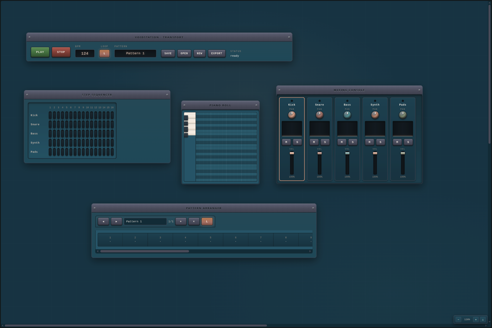

# VOIDSTATION

[](LICENSE)

An analog-hardware-styled web DAW built with TypeScript and the Web Audio
API. No backend, no dependencies: patterns, samples, effects, the playlist
and the wall layout all live in the browser and persist to `localStorage`.

The interface is a canvas-style studio room — drag hardware modules (step
sequencer, piano roll, playlist, mixer, transport) around a 3400×2800 wall,
zoom with `Ctrl`+wheel, and arrange a full track: 16-step sequencing,
piano-roll notes, per-track reverb/delay/EQ, sample trimming, loop regions,
WAV export, and gesture-based undo/redo.

The old UI is archived in git tag `legacy-vscode-ui`.

## Run

```bash
npm install
npm run build     # compiles src/**/*.ts → dist/
python3 -m http.server 8000
```

Then visit http://localhost:8000.



## UI — hardware wall

The main interface is a canvas-style "studio room": a large world
(3400×2800) with absolutely-positioned hardware modules you can drag by
their brushed-metal headers. Pan with native scroll, zoom with
`Ctrl`+wheel (or the HUD `— / % / + / ⌂` buttons).

Modules (one feature = one file in `src/ui/`):

| Module | Description |
| --- | --- |
| Transport | play/stop, BPM, loop toggle, pattern name, SAVE / OPEN / NEW / EXPORT, status readout; shortcuts `Space`, `Ctrl+S/O/N`, `Ctrl+Z/Y` |
| Step sequencer | 16 steps × 5 tracks, rubber MPC pads, playing-column highlight |
| Piano roll | 24 pitch rows (B4..C3) × 16 steps, key strip with preview, draw / resize / erase, playing-cell highlight |
| Playlist | 20 bar cells, pattern switching, clip drag & drop, loop region with draggable handles |
| Mixer | 5 analog channels: pan knob, LED meter, mute/solo, volume fader, channel click selects the piano-roll track |

Module positions persist across reloads (`voidstation-wall-v1`).

## Features

- **Audio engine** (`src/audio/engine.ts`): lazy `AudioContext`, per-track
  insert chain (voice → effects → gain → pan → master), 16-step Web Audio
  scheduling, BPM, offline render to WAV export.
- **Effects**: reverb (ConvolverNode + procedural stereo IR, Room/Hall/Plate),
  delay (feedback loop), 3-band EQ (lowshelf 250 Hz / peaking 1 kHz / highshelf
  4 kHz) — per-track, live and in export.
- **Samples**: load a sample per track, canvas waveform with draggable
  start/end trim handles, preview by clicking the wave.
- **Piano roll**: draw / resize / erase notes, real-time playback preview.
- **Playlist**: patterns, clip drag & drop (move/swap), loop region rendered
  into the WAV export.
- **Mixer**: pan, mute/solo, volume fader — all audible live and in export.
- **Undo/redo**: snapshot history (limit 20), transaction per gesture,
  `Ctrl+Z` / `Ctrl+Y` / `Ctrl+Shift+Z`.
- **Persistence**: project save/load to `localStorage`
  (`voidstation-project-v1`), wall layout separately.

## Structure

```
index.html              — shell, links src/styles/*.css, loads dist/main.js
src/main.ts             — bootstrap: build UI, auto-load project
src/audio/engine.ts     — Web Audio context, scheduling, effects, offline render
src/audio/wav.ts        — WAV encode for export
src/types.ts            — shared types
src/ui/theme.ts         — track names/colors, storage keys, clamp
src/ui/hardwareWall.ts  — the canvas wall: pan/zoom/drag modules
src/ui/rack.ts          — chassis primitives (panel, LED, button, readout, group)
src/ui/topbar.ts        — fixed header (brand, transport, sampler toggle)
src/ui/drawer.ts        — slide-out sampler panel
src/ui/transport.ts     — transport: bar controls + file-ops wall module
src/ui/stepSequencer.ts — 16×5 pad sequencer module
src/ui/pianoRoll.ts     — piano roll module
src/ui/playlist.ts      — playlist module
src/ui/mixer.ts         — mixer module
src/ui/fx.ts            — per-track reverb/delay/EQ rack
src/ui/sampler.ts       — sample load/trim/preview
src/ui/app.ts           — assembly: engine + wall + modules + wiring
src/styles/            — theme/base/racks/topbar/transport/drawer/sequencer/pianoroll/playlist/mixer/fx/sampler
```

`dist/` (compiled JS) and `node_modules/` are git-ignored; the engine
sources live in TS, the build runs via `tsc` into `dist/`.

## Design

Muted cold-dark base (`#0F3040`), brushed-metal panels and headers with
screws, VFD/CRT readouts with amber glow, rubber MPC pads, analog knobs and
faders — inspired by image_5. Palette tokens live in
`src/styles/theme.css`.
